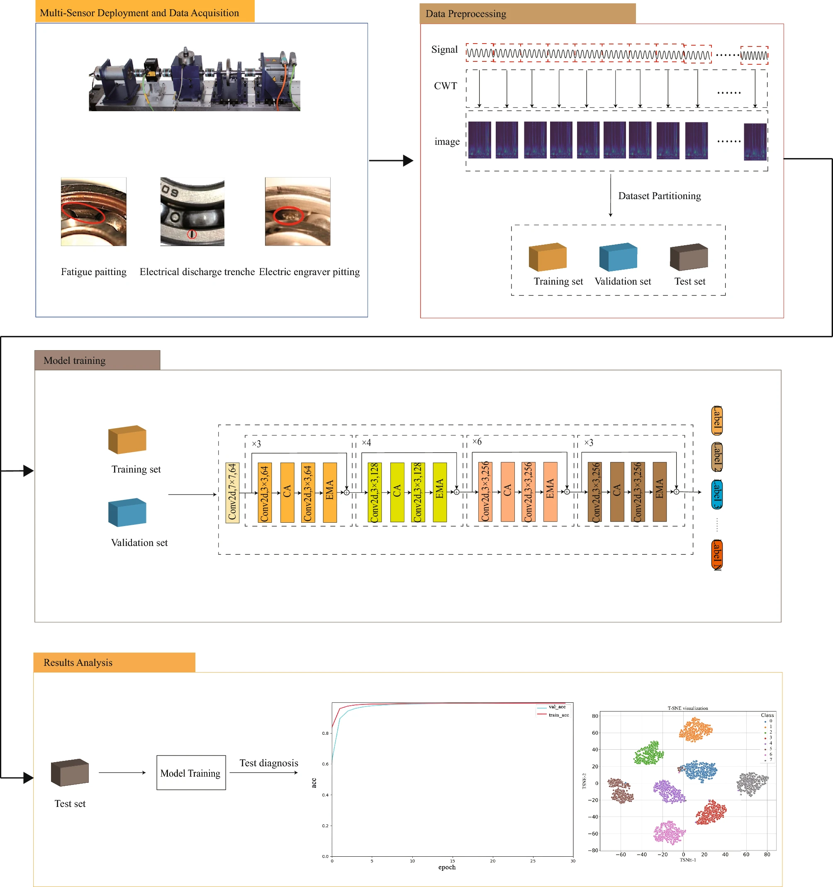
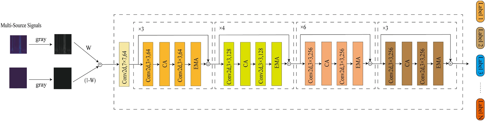
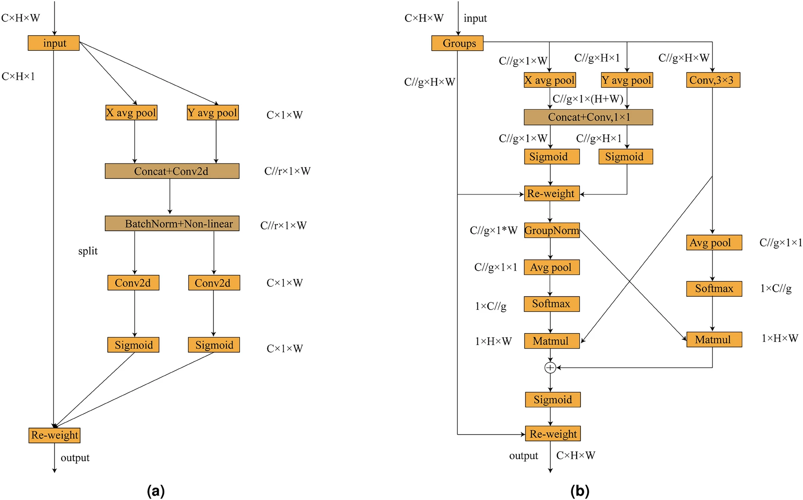

# MIRCA Paper

**Paper** : Intelligent fault diagnosis based on multi-source information fusion and attention-enhanced networks

**Author** : Chuan Tong, Ling Chen, Jingzhe Zhang & Zhuowen Zhao 

**Journal** : Scientific Reports, Article number: 36222 (2025) 

https://www.nature.com/articles/s41598-025-20231-2

## Methodology

### Model Pipeline

1. Vibration + current signal collection
2. Split into normalized and fixed length sections
3. Apply CWT → Create time-frequency images
4. Image grayscale conversion
5. Weight-based grayscale fusion generates a single fusion image
6. Enter fusion images into the MIRCA network
7. Fault type output from classifier

### Summary of the overall structure of the MIRCA model

- Input : fused time-frequency image
- Components:
    - Multi-source Fusion Module
    - Convolution + Attention 기반 Feature Extractor
    - Classification Head (FC + Softmax)
- The network consists of four steps in a hierarchical structure
- Each step consists of Residual structure + CA + EMA combination

### Multi-source Fusion Module - Data Level Fusion

- Convert vibration + current signal to CWT respectively → time-frequency image
- Reduce redundant/unnecessary information by converting images to grayscale
- Use pixel-level weighted fusion
- Core goal: Complementary convergence of information from different sensors

### Overview of MIRCA Block Structure

- Each step is repeated in the following configuration:
    - Convolution → local feature extraction
    - Coordinate Attention (CA) → Reflect position sensitive global information
    - Convolution → Additional local extraction
    - Efficient Multi-scale Attention (EMA) → multi-scale/long distance dependency
- Apply shortcut downsampling except for the first stage → receive field expansion by reducing the size of feature map and increasing the channel

#### Coordinate Attention (CA)

- Regular CNNs may lose spatial location information → CA supplements this
- CA will pool the feature map by height/width direction 
    - → Directed information + maintained accurate location information
- Results: Network can focus important features more strongly at specific time/frequency locations

#### Efficient Multi-scale Attention (EMA)
- Looking at the single-scale characteristics, only certain size defects are well caught and weak at different scales
- EMA focuses on multi-scale + cross-spatial feature learning
- Structure
    - Split input channels into groups
    - Three parallel branches (1×1, 1×1, 3×3)
    - → Reflects features on different scales/processing methods
    - Combine each branch information to create a complex scale representation
- Effectiveness: Can learn robustly even signs of large scale differences

